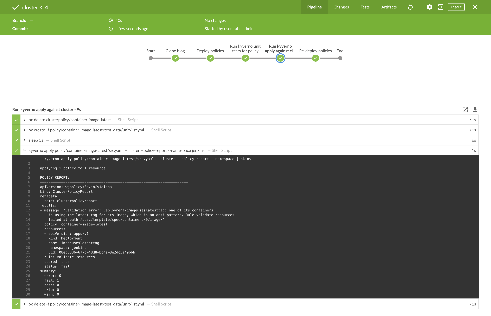
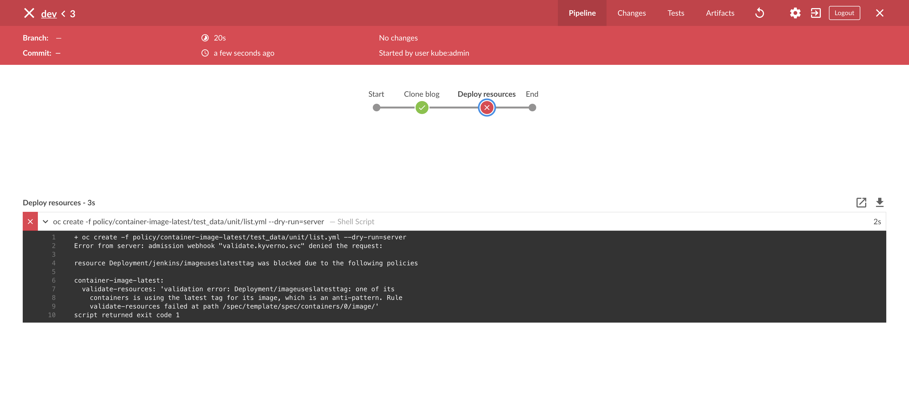

[]()

[](https://github.com/garethahealy/kyverno-validate-blog/actions/workflows/tests.yaml)

# Automate Your Security Practices and Policies on OpenShift With Kyverno
In a previous [blog post](https://cloud.redhat.com/blog/automate-your-security-practices-and-policies-on-openshift-with-open-policy-agent), 
I discussed the OPA policy engine and how it could be used to validate your Kubernetes resources by left-shifting your security and policy enforcement.

In this blog post, we will have a look at another tool, [Kyverno](https://kyverno.io/) which is an open-source project,
that is not sponsored by Red Hat nor is it supported under a Red Hat subscription,
which aims to solve the problem in a slightly different manner.

## What Is Kyverno?
> https://github.com/kyverno/kyverno

From the [website](https://kyverno.io):

> Kyverno is a policy engine designed for Kubernetes. 
> With Kyverno, policies are managed as Kubernetes resources and no new language is required to write policies. 
> This allows using familiar tools such as kubectl, git, and kustomize to manage policies. 
> Kyverno policies can validate, mutate, and generate Kubernetes resources. 
> The Kyverno CLI can be used to test policies and validate resources as part of a CI/CD pipeline.

In simple term, it is a policy engine that allows you to build rules for your Kubernetes resources that can allow or deny the resource to be applied to a cluster.

The following diagram provides an overview of the Kyverno architecture:


## How Is Kyverno Different From OPA?
Kyverno is designed and built to only run on Kubernetes and is not a general-purpose policy engine like OPA, which creates
positives and negatives when comparing it against OPA.
The main positive is that if you have been using Kubernetes for a number of years, using Kyverno will be second nature.
However, if you work for an enterprise company, this means introducing another tool that is only used for a specific use case,
which can create knowledge-sharing issues.

## OK, What’s a HelloWorld Policy Look Like?
The first step to using Kyverno is writing a `HelloWorld` policy that outputs the `input` object:

```yaml
1	apiVersion: kyverno.io/v1
2	kind: ClusterPolicy
3	metadata:
4	  name: helloworld
5	spec:
6	  validationFailureAction: enforce
7	  rules:
8	  - name: echo-object
9	    match:
10	      any:
11	      - resources:
12	          kinds:
13	          - Deployment
14	    validate:
15	      message: "input == {{request.object}}"
16	      pattern:
17	        kind: "Deployment"
```

Once we have a policy, we can look at the toolset to execute it. Kyverno provides a Kubernetes controller, as well as a CLI.

### Kubernetes Controller
The controller is the main use case for running Kyverno. It natively integrates with Kubernetes via an admission review so that
all API requests are validated via Kyverno.

It can be [installed](https://kyverno.io/docs/installation) via `helm` or `oc create` within a few minutes. However, it does require `cluster-admin`
as you will need to install several `CRDs`.

### CLI
The CLI offers a few different commands for developing policies as well as, running policies as part of your CI/CD process.
- validate: checks the policy can be parsed and contains the correct properties
- test: run unit style tests against policies which is helpful when writing and releasing policies.
- apply: applies policies to local resources which can be integrated into your CI/CD process.

```bash
$ kyverno --help
Kubernetes Native Policy Management

Usage:
  kyverno [command]

Available Commands:
  apply       applies policies on resources
  completion  generate the autocompletion script for the specified shell
  help        Help about any command
  test        run tests from directory
  validate    Validates kyverno policies
  version     Shows current version of kyverno
```

It can be [installed](https://kyverno.io/docs/kyverno-cli) via `krew` or from source. An undocumented but standard approach is to download
the compiled binary from the [GitHub releases](https://github.com/kyverno/kyverno/releases).

## OK, Let's Take a Look at a Simple Policy

```yaml
 1	apiVersion: kyverno.io/v1
 2	kind: ClusterPolicy
 3	metadata:
 4	  name: container-image-latest
 5	  annotations:
 6	    policies.kyverno.io/owner: Red Hat CoP
 7	    policies.kyverno.io/category: Workload Management
 8	    policies.kyverno.io/description: Check a Deployment is not using the latest tag for their image
 9	spec:
 10	  validationFailureAction: enforce
 11	  rules:
 12	  - name: validate-resources
 13	    match:
 14	      resources:
 15	        kinds:
 16	          - Deployment
 17	    validate:
 18	      message: "{{request.object.kind}}/{{request.object.metadata.name}}: one of its containers is using the latest tag for its image, which is an anti-pattern."
 19	      pattern:
 20	        spec:
 21	          template:
 22	            spec:
 23	              containers:
 24	              - name: "*"
 25	                image: "!*:latest"
```

Hopefully, the above is easy to understand if you are comfortable with Kubernetes resources.
Let's go line by line and explain what each bit is doing:
- _line 1 to 2_: declares what type of resource it is, which in this example is cluster-wide
- _line 3 to 8_: is defining the metadata about the policy
- _line 10_: states what action should be taken when the policy is triggered, which in this case is denied
- _line 11 to 16_: is defining the selectors, which this policy should match against
- _line 18_: is the message which is returned when the policy is triggered
- _line 29 to 25_: is what the policy is enforcing. In this example, we are using a couple of bits of regex to say match any containers that  have their image ending with ':latest'

## Cool, How Do I Run That?
To run the above policy, it is expected the following tools are installed:
- [Kyverno](https://kyverno.io/docs/kyverno-cli/)
- [bats-core](https://github.com/bats-core/bats-core#installation), which is a testing framework that will execute Kyverno.
- [jq](https://stedolan.github.io/jq/download), which is used by the BATS framework to process JSON files.
- [yq](https://pypi.org/project/yq), which is used by the BATS framework to process YAML files.

You can execute the above policy by running the below commands.
_NOTE_: A user with cluster-admin permissions is required to deploy Kyverno.

```bash
git clone https://github.com/garethahealy/kyverno-validate-blog.git
cd kyverno-validate-blog

echo "Let's have a look at the test data..."
cat policy/container-image-latest/test_data/unit/list.yml

echo "Let's have a look at the policy..."
cat policy/container-image-latest/src.yaml

echo "Let's have a look at the BATS tests..."
cat test/kyverno-unittests.sh

echo "Now, let's run the kyverno tests locally against that data.."
bats test/kyverno-unittests.sh

echo "Cool. Everything works as expected locally. But what about on-cluster?"

echo "Now, let's deploy kyverno (cluster-admin permissions required with a valid session)..."
test/deploy-kyverno.sh deploy_kyverno

echo "Now, let's deploy the kyverno policies..."
test/deploy-kyverno.sh deploy_policy

echo "Finally, Let's check the policy is active for our namespace..."
bats test/kyverno-integrationtests.sh
```

So what did the above do?
- You executed `test/kyverno-unittests.sh`, which used `BATS` to run `kyverno` which validated the policy worked as expected locally.
- You executed `test/deploy-kyverno.sh deploy_kyverno`, which deployed Kyverno onto your cluster in the `kyverno` namespace.
- You executed `test/deploy-kyverno.sh deploy_policy`, which applied a `ClusterPolicy` Kyverno CR to your cluster.
- You executed `test/kyverno-integrationtests.sh`, which used `BATS` to run `oc create` which validated the policy worked as expected on-cluster.

If you are unable to install the software required, you can [fork](https://github.com/garethahealy/kyverno-validate-blog) my GitHub repository
which contains an [action](https://github.com/garethahealy/kyverno-validate-blog/actions/workflows/tests.yaml?query=is%3Asuccess) that runs the above
on commit. So why not have a tinker in your own little playground.

## OK, But How Do I Fit That Into My CI/CD Pipeline?
I have previously mentioned `left-shifting` your company’s policies, but what does this mean in practical terms for Kyverno?
The following example presumes you are using a Jenkins deployed onto your cluster via:

```bash
oc new-project jenkins
oc process jenkins-persistent -p DISABLE_ADMINISTRATIVE_MONITORS=true -p MEMORY_LIMIT=2Gi -n openshift | oc create -n jenkins -f -
oc rollout status dc/jenkins --watch=true -n jenkins
```

If you are using another CI/CD tool, the key point is that we want to execute `kyverno` before deploying to the cluster.
To be able to execute that bash script, you will need to replicate the same functionality from this [Dockerfile](https://github.com/garethahealy/kyverno-validate-blog/blob/master/jenkins/Dockerfile).

Firstly, we need to build a Jenkins agent which can execute `BATS` and `kyverno` in our Jenkins project.

```bash
oc import-image quay.io/redhat-cop/jenkins-agent-python:v1.0 --confirm -n jenkins
oc create -f jenkins/KyvernoBuildConfig.yaml -n jenkins
oc start-build kyverno-docker-build -n jenkins -w
```

Once the build is complete, let's allow the `jenkins` service account to create Kyverno policies:

```bash
oc adm policy add-cluster-role-to-user kyverno:admin-policies system:serviceaccount:jenkins:jenkins
```

Next, let's open Jenkins and create two new pipeline jobs. The first is for our `cluster-admin` who
controls the policies:

```groovy
node ("jenkins-agent-kyverno") {
  stage("Clone blog") {
    sh "git clone https://github.com/garethahealy/kyverno-validate-blog.git"
  }

  stage("Deploy policies") {
    dir("kyverno-validate-blog") {
      sh "oc delete clusterpolicy --all"
      sh "test/deploy-kyverno.sh deploy_policy"
    }
  }

  stage("Run kyverno unit tests for policy") {
    dir("kyverno-validate-blog") {
      sh "bats test/kyverno-unittests.sh"
    }
  }

  stage("Run kyverno apply against cluster") {
    dir("kyverno-validate-blog") {
      //Make sure no policies exist, or we wont be able to create the resource
      sh "oc delete clusterpolicy/container-image-latest"
      sh "oc create -f policy/container-image-latest/test_data/unit/list.yml"

      //Lets just wait to make sure the test data is created
      sh "sleep 5s"
      sh "kyverno apply policy/container-image-latest/src.yaml --cluster --policy-report --namespace jenkins"
      sh "oc delete -f policy/container-image-latest/test_data/unit/list.yml"
    }
  }

  stage("Re-deploy policies") {
    dir("kyverno-validate-blog") {
      sh "test/deploy-kyverno.sh deploy_policy"
    }
  }
}
```

Which once triggered should give you similar output to:



The second is for our developers who will be creating resources that might trigger the policies:

```groovy
node ("jenkins-agent-kyverno") {
  stage("Clone blog") {
    sh "git clone https://github.com/garethahealy/kyverno-validate-blog.git"
  }

  stage("Deploy resources") {
    dir("kyverno-validate-blog") {
      sh "oc create -f policy/container-image-latest/test_data/unit/list.yml --dry-run=server"
    }
  }
}
```

This should give you a similar output to the below, which shows our deployment being rejected:



## So, OPA or Kyverno?
OPA and Kyverno solve the problem of resource validation in different ways. Depending on the scenario, each has their benefits
and negatives.

- If you are new to Kubernetes or do not have any hands-on experience in writing code, Kyverno is the winner. It is simpler to understand
  and for simple policies, easy to write for.
- If you are an experienced "power-user" or need to write complex policies, OPA is the winner. As policies are written in `rego`, anything
  is possible.

## Thanks to...
For reviewing and giving great feedback:
- [snecklifter](https://github.com/snecklifter)